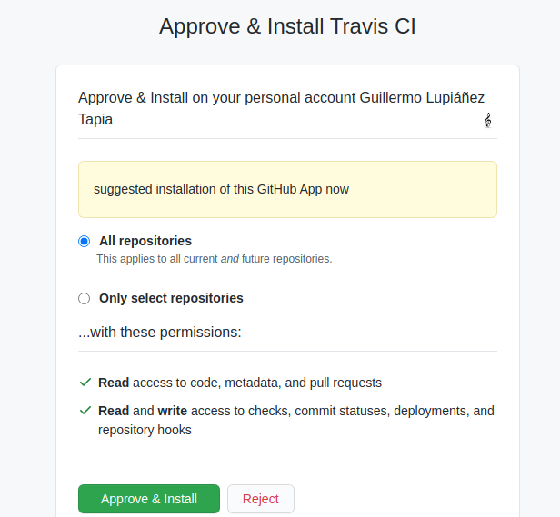

# Repo para subir los ejercicios de la asignatura Infraestructura Virtual en la UGR

## Ejercicios sobre desarrollo basado en pruebas

### Ejercicio 1: Hacer los tests de un compañero

... Aún sin hacer ...

### Ejercicio 9: Usar TravisCI

- Conectar TravisCI con GitHub

- Activar Travis en el repositorio de mi proyectos

