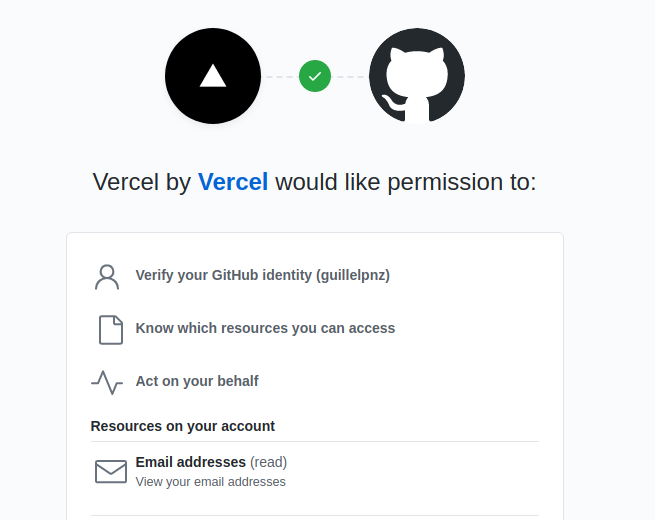
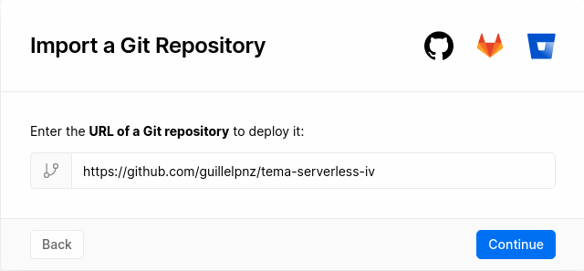
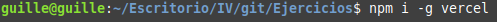
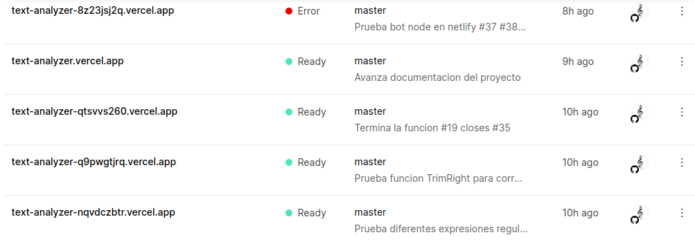
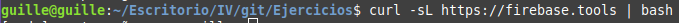
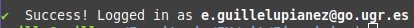
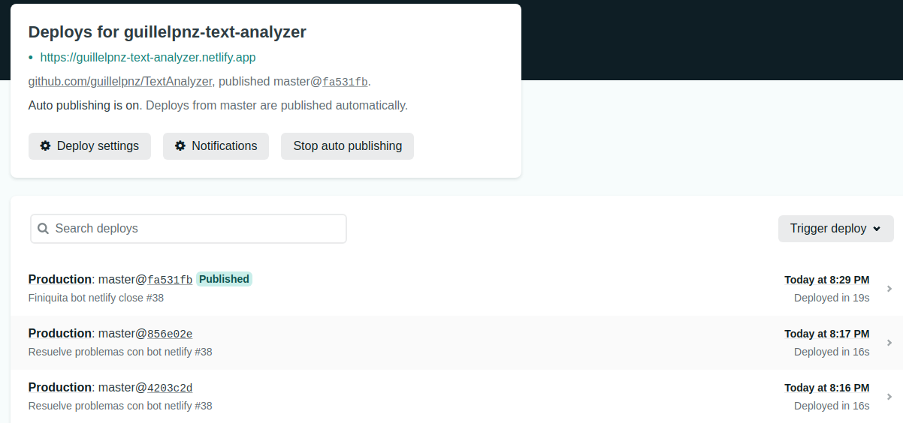
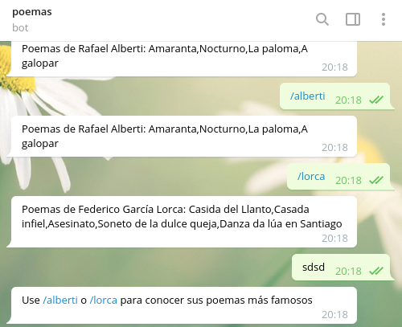

# Ejercicios del tema Serverless

## Ejercicio 1: Darse de alta en Vercel y Firebase, y descargarse los SDKs para poder trabajar con ellos localmente

### Configuración e instalación de Vercel

#### Configuración

Podemos registrarnos mediante GitHub:

Posteriormente pide que importemos algún proyecto(repositorio) de GitHub a Vercel

#### Instalación SDK

Descargamos el VercelCLI de la forma en que se nos indica en la página oficial del software:

Los pushes automáticos se configuraron automáticamente al conectar Vercel y mi repo:

### Instalación de Firebase

Ejecutamos el siguiente comando:

En la consola ejecutamos firebase login, y conectamos una cuenta de Google
para poder usar el servicio:

## Ejercicio 2: Tomar alguna de las funciones de prueba de Vercel, y hacer despliegues de prueba con el mismo

Lo que hice fue crearme un repo para esta api de prueba, llamado
[tema-serverless-iv](https://github.com/guillelpnz/tema-serverless-iv)

Posteriormente, seguí las instrucciones para la creación de un fichero de
prueba que encontré: [Ejemplo Go](https://vercel.com/docs/serverless-functions/supported-languages#go)

Así, creé la carpeta /api dentro de mi proyecto de prueba, y dentro copié el
fichero date.go del anterior link.

Para ver el funcionamiento basta con visitar [esta página](https://tema-serverless-iv.vercel.app/api/date)

Y como vemos hace algo tan simple como imprimir la fecha actual.

## Ejercicio 3: Probar funciones con Netlify

Primero conecté Netlify con Github dándole a siguiente
y los pushes automáticos se configuraron automáticamente:

Hice un Bot con Node.js que lista los poemas más famosos de Federico García Lorca
y de Rafael Alberti. Aquí una muestra del funcionamiento:

Aquí el código del bot:

[Código](https://github.com/guillelpnz/TextAnalyzer/tree/master/functions)
