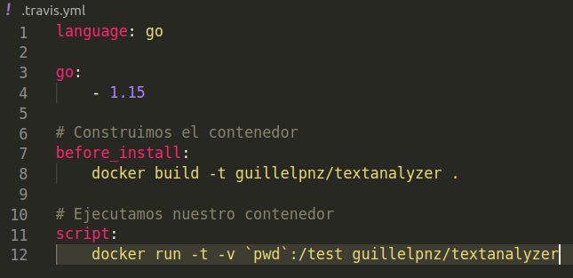
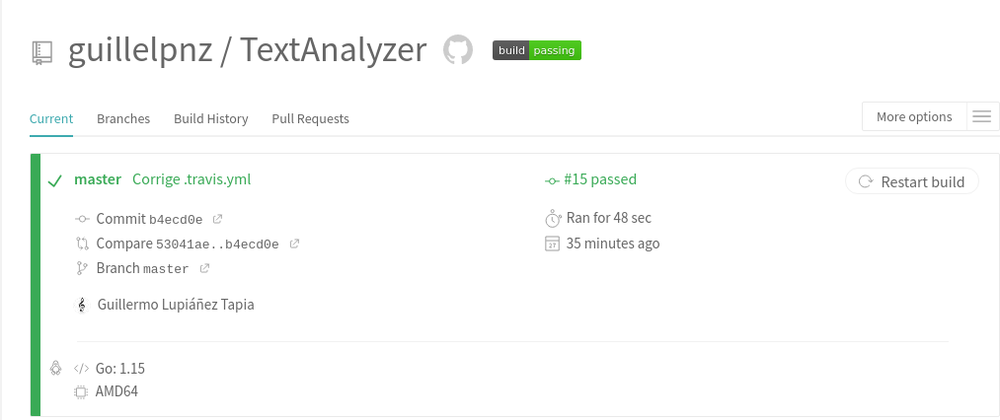

# Ejercicios sobre desarrollo basado en pruebas

## Ejercicio 1: Hacer los tests de un compañero

... Aún sin hacer ...

## Ejercicio 9: Usar TravisCI

- Conectar TravisCI con GitHub

- Activar TravisCI en el repositorio de mi proyectos

## Ejercicio 10: Configurar integración continua usando TravisCI

Para llevar a cabo la ejecución automática de tests, necesitamos un fichero
.travis.yml subido. Este es el mío:

Se usa el contenedor Docker del hito anterior. El cambio que ha habido ha sido
la instalación de un linter.

Comprobación de que funciona correctamente:

