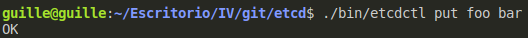
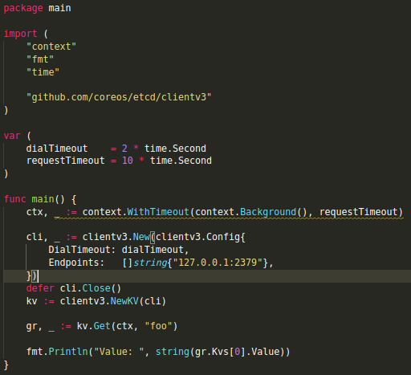
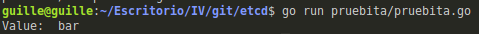

# Ejercicios sobre el tema de microservicios

## Ejercicio 1: Instalar etcd3, averiguar qué bibliotecas funcionan bien con el lenguaje que estemos escribiendo el proyecto (u otro lenguaje), y hacer un pequeño ejemplo de almacenamiento y recuperación de una clave; hacer el almacenamiento desde la línea de órdenes (con etcdctl) y la recuperación desde el mini-programa que hagáis.

Para instalar etcd3 me fijé en la [documentación oficial](https://etcd.io/docs/v3.4.0/dl-build/#download-the-pre-built-binary)

Una vez seguidos esos pasos, donde se dice cómo almacenar un par clave = valor en etcd3,
procedí a almacenar mi variable:

Para poder recuperarla, me fijé en [este tutorial](https://www.compose.com/articles/utilizing-etcd3-with-go/)

Y así quedó mi código de prueba:

Así la salida de mi programa:

